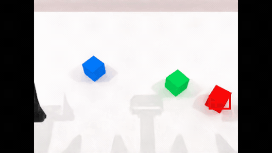
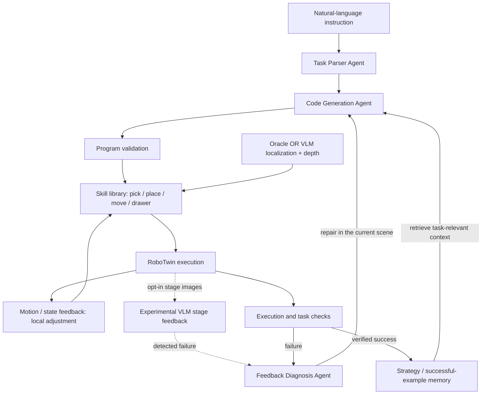

# GAPA: Memory-Augmented Robot Programming

[中文](README.zh-CN.md) · **English** · [Architecture](docs/architecture.md) · [Experiments](docs/experiments.md)

**Turn natural-language instructions into robot skill programs, inspect execution feedback, and recover in the current scene.**

GAPA is an experimental program-generation layer built on **RoboTwin 2.0**. Task parsing, code generation, and feedback diagnosis work as three cooperating agent roles. Generated programs compose a constrained skill library for grasping, placing, moving, and drawer manipulation. VLM localization, execution checks, and task-specific memory support the workflow.

## See it run

| Controlled drop and Agent recovery | Ordered block stacking |
| :---: | :---: |
|  |  |
| Injected gripper release makes the cup fall; the Agent reobserves, adjusts its grasp, and succeeds in the same scene. | A natural-language instruction becomes a sequence of robot skills. |

Left: a new controlled-fault trial with stage checks and Agent-generated recovery. Right: a historical stacking demo. Neither is a benchmark. See [record provenance and evaluation status](docs/experiments.md).

## What the system does

- **Agent collaboration:** parse an instruction into a structured task, generate a skill program, and use execution evidence to guide a correction.
- **Grounded skill execution:** obtain supported object or functional-point positions through Oracle state or VLM localization plus depth, then execute bounded skill calls.
- **Two levels of recovery:** adjust motion parameters inside supported skills; if that fails, diagnose the failure and regenerate the program without resetting the scene.
- **Task-specific memory:** retrieve relevant strategy templates for generation. An experimental extension archives successful programs and retrieves compatible skill-parameter references.

**Experimental:** opt-in feedback at `after_lift` and `after_place` combines multi-view visual reports with a simulator-state lift check. These checks happen between skill stages, not continuously at every control step. Their overall effect on recovery and latency still needs controlled evaluation.

## Local verification

On an RTX 4060 Laptop, the fixed-seed cup-placement smoke run passed the native
task check both before and after enabling the new monitor. The monitored run
recorded `after_lift` and `after_place` observations; 36 focused regression tests
passed. These are functional checks, not a measured success-rate improvement.
[Results, limitations, and reproduction commands →](docs/experiments.md)

## How it works



The VLM path does **not** make this a vision-only robot controller. Motion primitives still use simulator actor and contact information, while final task success is checked by deterministic environment rules. [Architecture and boundaries →](docs/architecture.md)

## Try it locally

First install the RoboTwin environment and assets using the preserved [upstream README](README.RoboTwin.md). From the repository root:

```bash
pip install -r gapa/requirements.txt
cp gapa/gapa_api.env.example gapa/gapa_api.env
```

Set your LLM endpoint, model, and key in `gapa/gapa_api.env`. Configure a VLM endpoint as well to use visual localization or experimental visual feedback. Then start the local UI:

```bash
python -m uvicorn gapa.web.app:app --host 127.0.0.1 --port 7860
```

Open **http://127.0.0.1:7860**, choose scene objects and a seed, generate the scene, then enter an instruction. For example, with the corresponding objects selected:

- “Place the cup on the plate.”
- “Arrange the red, green, and blue blocks from left to right.”
- “Stack the blocks with red at the bottom, green in the middle, and blue on top.”
- “Put the playing cards into the cabinet.”

The UI exposes generated programs, traces, scene images, feedback, and videos under `runs_gapa/`.

For an isolated cup-placement run with its own output and memory:

```bash
python -m gapa.evaluate --case cup --seed 2 --perception oracle \
  --output runs_gapa/showcase/baseline
```

Add `--stage-feedback` to enable experimental visual checks, and use a **new output directory** for each run. Each trial allows up to three generation rounds. See [experiment settings and interpretation](docs/experiments.md).

## Scope and evidence

The current task vocabulary covers supported object placement, selected objects placed into a cabinet, two- or three-block rows and stacks, small relative moves, and sequential compositions of supported tasks. Unsupported instructions are rejected before program generation.

The current scope is simulation with a fixed supported object set. Controlled evaluation of memory and VLM stage feedback is pending; the [experiment page](docs/experiments.md) records development cases, comparison settings, and verification status.

## Built on RoboTwin

This repository extends [RoboTwin](https://github.com/RoboTwin-Platform/RoboTwin) with the GAPA program-generation and execution layer. The simulator, robot assets, and underlying robot-control infrastructure come from the upstream project. Its original documentation and citation information remain in [README.RoboTwin.md](README.RoboTwin.md); see also [LICENSE](LICENSE).
