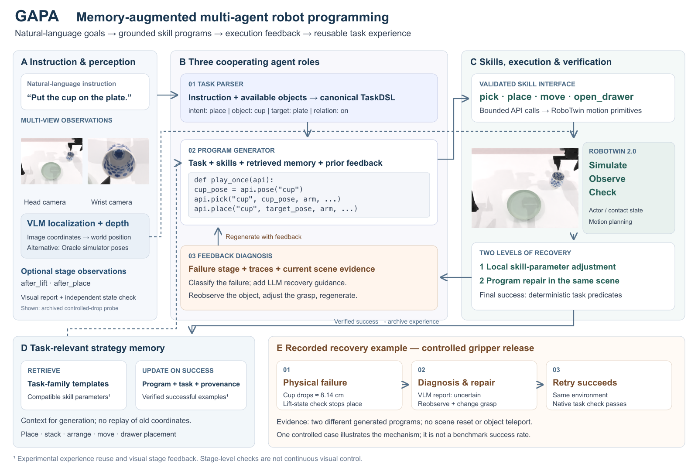
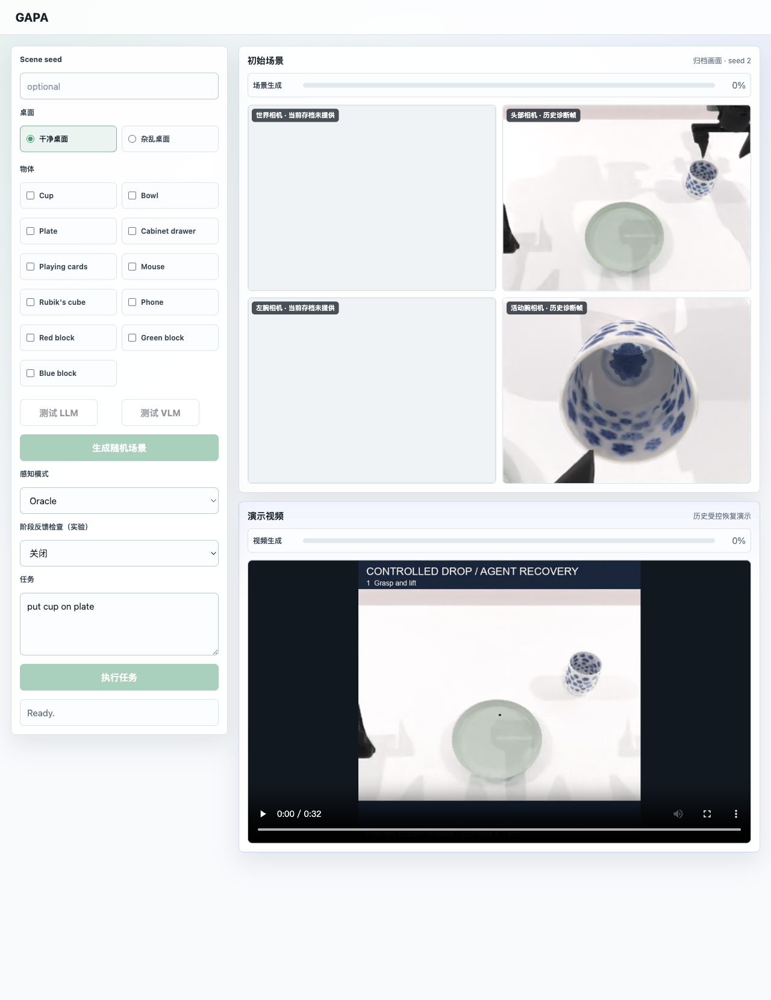

<h1 align="center">GAPA</h1>
<p align="center"><strong>Memory-augmented robot programming with multi-agent feedback</strong></p>
<p align="center">Natural language → robot skills → execution feedback → reusable experience</p>
<p align="center"><a href="README.zh-CN.md">中文</a> · <strong>English</strong> · <a href="docs/architecture.md">Architecture</a> · <a href="docs/experiments.md">Experiments</a></p>

GAPA builds on **RoboTwin 2.0** to turn natural-language instructions into executable robot skill programs. **Task parsing, program generation and feedback diagnosis** work together to compose skills, repair failed executions in the current scene, and retrieve task-relevant experience.



## See it in action

<table>
<tr><th width="50%">01 · Recover after a controlled drop</th><th width="50%">02 · Stack in the requested order</th></tr>
<tr><td></td><td></td></tr>
<tr><td>An injected gripper release drops the cup. The Agent reobserves the scene, adjusts the grasp and completes placement without a scene reset.</td><td>A natural-language instruction becomes an ordered sequence of grasping and placement skills.</td></tr>
</table>

*Left: a recorded controlled-fault trial. Right: a historical stacking demo. These illustrate behavior, not benchmark success rates. [Demo provenance →](assets/demos/README.md)*

## What makes it work

| Component | Role |
| :--- | :--- |
| **Three cooperating agents** | Parse goals, generate skill programs and diagnose failures through separate roles. |
| **Grounded skill library** | Compose grasping, placement, movement and drawer skills; use Oracle state or VLM localization with depth for supported queries. |
| **Feedback-driven repair** | Adjust parameters inside supported skills, then diagnose and regenerate when local recovery is insufficient. |
| **Task-relevant memory** | Retrieve strategy templates; optionally archive successful programs and reuse compatible skill-parameter references. |

### Verification so far

A fixed-seed cup-placement check passed with and without the new monitor on an RTX 4060 Laptop; **36 focused regression tests passed** in the recorded run. The replacement recovery demo records a real drop followed by a changed Agent-generated program and native task success.

Optional VLM checks run at `after_lift` and `after_place`, **not at every control step**. Successful-example memory and visual stage feedback remain experimental; controlled success-rate and latency comparisons are pending. The runtime still uses simulator state and contact information. [Results, limitations and reproduction commands →](docs/experiments.md)

## Web interface



The frontend brings scene setup, perception options, task input, camera previews and execution video into one workspace. This screenshot renders the repository's actual frontend with archived diagnostic frames and a recorded recovery video; it is a **read-only preview, not a live simulation run**. Unavailable camera views are explicitly marked. [Screenshot provenance](docs/presentation.md)

## Try it locally

First install the RoboTwin environment and assets using the preserved [upstream README](README.RoboTwin.md). From the repository root:

```bash
pip install -r gapa/requirements.txt
cp gapa/gapa_api.env.example gapa/gapa_api.env
```

Set your LLM endpoint, model, and key in `gapa/gapa_api.env`. Configure a VLM endpoint as well to use visual localization or experimental visual feedback. Then start the local UI:

```bash
python -m uvicorn gapa.web.app:app --host 127.0.0.1 --port 7860
```

Open [http://127.0.0.1:7860](http://127.0.0.1:7860), choose scene objects and a seed, generate the scene, then enter an instruction. For example, with the corresponding objects selected:

- “Place the cup on the plate.”
- “Arrange the red, green, and blue blocks from left to right.”
- “Stack the blocks with red at the bottom, green in the middle, and blue on top.”
- “Put the playing cards into the cabinet.”

The UI exposes generated programs, traces, scene images, feedback, and videos under `runs_gapa/`.

For an isolated cup-placement run with its own output and memory:

```bash
python -m gapa.evaluate --case cup --seed 2 --perception oracle \
  --output runs_gapa/showcase/baseline
```

Add `--stage-feedback` to enable experimental visual checks, and use a **new output directory** for each run. Each trial allows up to three generation rounds. See [experiment settings and interpretation](docs/experiments.md).

## Scope and evidence

The current task vocabulary covers supported object placement, selected objects placed into a cabinet, two- or three-block rows and stacks, small relative moves, and sequential compositions of supported tasks. Unsupported instructions are rejected before program generation.

The current scope is simulation with a fixed supported object set. Controlled evaluation of memory and VLM stage feedback is pending; the [experiment page](docs/experiments.md) records development cases, comparison settings, and verification status.

## Built on RoboTwin

This repository extends [RoboTwin](https://github.com/RoboTwin-Platform/RoboTwin) with the GAPA program-generation and execution layer. The simulator, robot assets, and underlying robot-control infrastructure come from the upstream project. Its original documentation and citation information remain in [README.RoboTwin.md](README.RoboTwin.md); see also [LICENSE](LICENSE).
