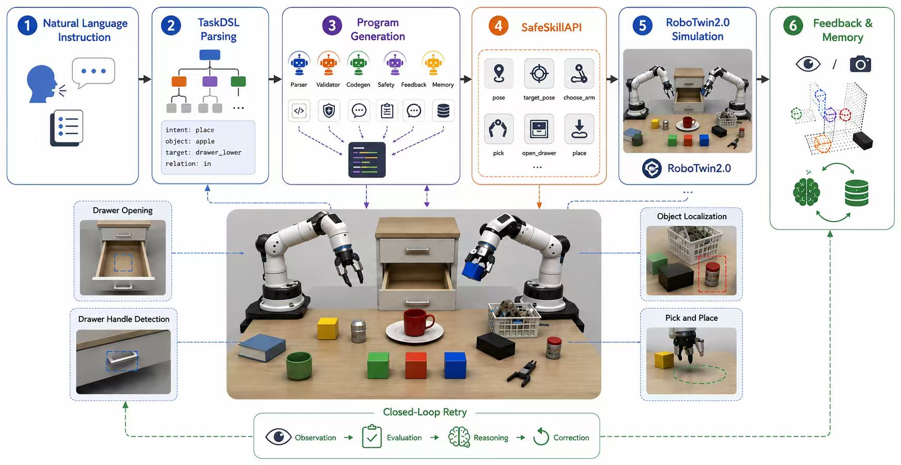

# 面向 RoboTwin 的 GAPA 扩展

中文 | [English](README.md)

这个仓库是在 RoboTwin 2.0 工作区上扩展出的 **GAPA**
（*Grasp Anything and Put Anywhere*）版本。GAPA 是一个实验性的自然语言到机器人程序层：给定 RoboTwin 场景和自然语言指令后，它会解析任务、生成受限 Python 程序、做确定性安全检查，并通过 oracle 或 VLM 感知路径在仿真环境中执行和重试。

原始 RoboTwin README 已保留为
[`README.RoboTwin.md`](README.RoboTwin.md)。



## 相对原 RoboTwin 的主要改动

### 新增 GAPA 模块

- 新增 [`gapa/`](gapa/) 包，包含任务解析、LLM 代码生成、确定性安全检查、失败反馈重试、可切换的 VLM/oracle 感知辅助、运行产物生成和单用户 FastAPI Web UI。
- 新增受限运行时 API：[`gapa/runtime/api.py`](gapa/runtime/api.py)。生成程序只通过 `api.pick`、`api.place`、`api.open_drawer`、`api.pose`、`api.target_pose` 等接口操作环境，不直接访问 RoboTwin 底层细节。
- 新增标准化 TaskDSL：[`gapa/domain/task.py`](gapa/domain/task.py)，并通过 [`gapa/planning/validation.py`](gapa/planning/validation.py) 做任务硬门控。
- 新增策略级成功记忆：[`gapa/memory/`](gapa/memory/)。

### 新增 GAPA RoboTwin 环境

- 新增 [`envs/gapa_scene.py`](envs/gapa_scene.py)，作为 GAPA 使用的固定物体池 RoboTwin 任务环境。
- 新增 [`task_config/gapa_scene.yml`](task_config/gapa_scene.yml)，用于 GAPA 场景初始化。
- 将 RoboTwin 官方 cluttered-table 资产接入 GAPA 场景，并补充柜子/抽屉任务的布局约束。
- 为 GAPA 支持的任务族新增确定性成功判定细节。

### 新增 Web 和运行产物

- 新增 [`gapa/web/app.py`](gapa/web/app.py)，提供本地 FastAPI 前端，用于场景随机化、LLM/VLM 连通性测试、任务执行、预览图和视频展示。
- 新增 `runs_gapa/` 运行产物目录，保存 JSON/JSONL trace、生成程序、失败反馈、场景预览和修正视频。


## 仓库结构

```text
.
├── README.md                 # GAPA 英文入口
├── README.zh-CN.md           # GAPA 中文入口
├── README.RoboTwin.md        # 原始 RoboTwin README，已保留
├── envs/gapa_scene.py        # GAPA RoboTwin 场景
├── task_config/gapa_scene.yml
├── gapa/
│   ├── agents/               # 任务解析、代码生成、安全检查、反馈、编排
│   ├── clients/              # OpenAI-compatible LLM/VLM 客户端
│   ├── codegen/              # Prompt 构造和 AST 安全检查
│   ├── config/               # gapa_api.env 读取
│   ├── domain/               # 物体、TaskDSL、API 规格
│   ├── media/                # 视频和卡片生成
│   ├── memory/               # 策略记忆
│   ├── perception/           # VLM/oracle 感知辅助
│   ├── planning/             # 任务 planner facade 和 validator
│   ├── runtime/              # SafeSkillAPI、runner、成功判定
│   └── web/                  # FastAPI 应用
└── runs_gapa/                # 本地生成的运行产物
```

## 快速开始

先按照 [`README.RoboTwin.md`](README.RoboTwin.md) 和 RoboTwin 上游文档安装 RoboTwin 主环境。然后安装 GAPA 的轻量依赖：

```bash
pip install -r gapa/requirements.txt
```

配置 LLM/VLM ：

```bash
cp gapa/gapa_api.env.example gapa/gapa_api.env
```

编辑 `gapa/gapa_api.env`。

从仓库根目录启动 Web UI：

```bash
python -m uvicorn gapa.web.app:app --host 127.0.0.1 --port 7860
```

打开：

```text
http://127.0.0.1:7860
```

典型流程：

1. 选择 GAPA 物体。
2. 选择干净桌面或杂乱桌面。
3. 生成场景。
4. 输入自然语言任务。
5. 运行生成程序，并查看 trace / 视频产物。

## 支持范围

GAPA 当前只支持以下任务：

- 将 `cup`、`bowl` 或 RGB block 放到支持的目标上；
- 将 `playing_cards`、`mouse`、`rubiks_cube` 或 `phone` 放入 `cabinet`；
- 将两个或三个 RGB block 排成一行；
- 将两个或三个 RGB block 堆叠；
- 将可抓取物体按小距离做相对移动；
- 按顺序组合多个已支持的原子任务。

不支持的任务会停在 `task_validation` 阶段，不进入代码生成。

## 主要实现入口

| 模块 | 文件 |
| --- | --- |
| Web 路由 | [`gapa/web/app.py`](gapa/web/app.py) |
| Run 生命周期和场景缓存 | [`gapa/runtime/runner.py`](gapa/runtime/runner.py) |
| 生成程序 API | [`gapa/runtime/api.py`](gapa/runtime/api.py), [`gapa/domain/api_spec.py`](gapa/domain/api_spec.py) |
| GAPA 场景 | [`envs/gapa_scene.py`](envs/gapa_scene.py), [`task_config/gapa_scene.yml`](task_config/gapa_scene.yml) |
| 任务模型和验证 | [`gapa/domain/task.py`](gapa/domain/task.py), [`gapa/planning/validation.py`](gapa/planning/validation.py) |
| 物体注册表 | [`gapa/domain/objects.py`](gapa/domain/objects.py) |
| 代码生成和安全检查 | [`gapa/codegen/generator.py`](gapa/codegen/generator.py), [`gapa/codegen/safety.py`](gapa/codegen/safety.py) |
| 感知 | [`gapa/perception/providers.py`](gapa/perception/providers.py) |
| 视频和报告 | [`gapa/media/video_builder.py`](gapa/media/video_builder.py) |
