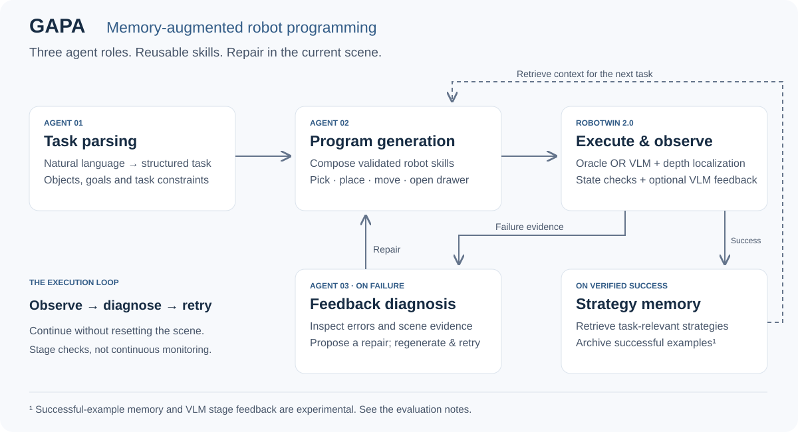
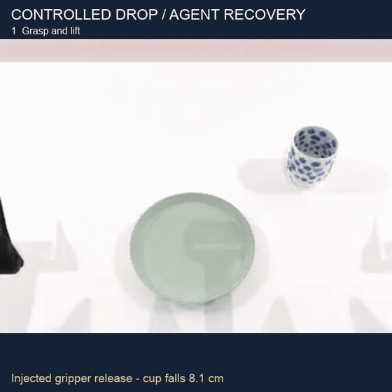

<h1 align="center">GAPA</h1>
<p align="center"><strong>记忆增强与反馈纠错的多智能体机器人程序生成</strong></p>
<p align="center">自然语言 → 机器人技能 → 执行反馈 → 可复用经验</p>
<p align="center"><strong>中文</strong> · <a href="README.md">English</a> · <a href="docs/architecture.md">系统架构</a> · <a href="docs/experiments.md">实验记录</a></p>

GAPA 基于 **RoboTwin 2.0**，将自然语言指令转化为可执行的机器人技能程序。**任务解析、程序生成与反馈诊断**三个 Agent 分工协作，组合技能完成操作，在当前场景中修正失败程序，并检索相关经验辅助后续任务。



## 运行演示

<table>
<tr><th width="50%">01 · 受控掉落后的诊断恢复</th><th width="50%">02 · 按指定顺序堆叠积木</th></tr>
<tr><td></td><td></td></tr>
<tr><td>人为松开夹爪使杯子掉落；Agent 重新观测、调整抓取，在不重置场景的情况下完成放置。</td><td>将自然语言要求转化为有序的抓取与放置技能调用，完成积木堆叠。</td></tr>
</table>

*左侧为实录的受控扰动试验，右侧为历史堆叠演示；用于展示行为，不代表基准成功率。[演示来源 →](assets/demos/README.md)*

## 核心机制

| 组成 | 作用 |
| :--- | :--- |
| **三个 Agent 协作** | 分别负责目标解析、技能程序生成与失败诊断。 |
| **感知与技能库** | 组合抓取、放置、移动及抽屉操作技能；支持的定位查询可使用 Oracle 状态或 VLM 与深度信息。 |
| **执行反馈纠错** | 先在支持的技能内部调整参数；局部恢复不足时，诊断失败并重新生成程序，在当前场景继续执行。 |
| **按任务检索记忆** | 检索策略模板；实验性扩展可保存成功程序，并复用兼容的技能参数作为参考。 |

### 已有验证

记录中的 RTX 4060 Laptop 固定种子杯子放置试验，在关闭与开启新增检查时均通过环境成功判定；**36 项定向回归测试通过**。新的恢复演示记录了实际掉落、Agent 修改抓取程序，以及最终通过环境任务判定的过程。

可选 VLM 检查发生在 `after_lift`、`after_place`，**不是逐控制步持续监控**。成功示例记忆与视觉阶段反馈仍属实验功能，成功率与延迟的对照评估尚待完成；底层运行仍使用仿真状态及接触信息。[结果、限制与复现命令 →](docs/experiments.md)

## 本地运行

先按照保留的 [RoboTwin 原始说明](README.RoboTwin.md) 安装仿真环境和资产，然后在仓库根目录运行：

```bash
pip install -r gapa/requirements.txt
cp gapa/gapa_api.env.example gapa/gapa_api.env
```

在 `gapa/gapa_api.env` 中填写 LLM 的服务地址、模型和密钥。使用视觉定位或实验性视觉反馈时，还需配置 VLM。随后启动本地界面：

```bash
python -m uvicorn gapa.web.app:app --host 127.0.0.1 --port 7860
```

打开 **http://127.0.0.1:7860**，选择场景物体和种子、生成场景，再输入任务。例如，在选好对应物体后：

- “把杯子放到盘子上。”
- “把红、绿、蓝积木从左到右排列。”
- “将积木按红色在底部、绿色在中间、蓝色在顶部的顺序堆叠。”
- “把扑克牌放入柜子。”

界面可以查看生成程序、执行轨迹、场景图像、诊断反馈和视频，运行产物保存在 `runs_gapa/`。

也可以启动一次输出目录与记忆隔离的杯子放置试验：

```bash
python -m gapa.evaluate --case cup --seed 2 --perception oracle \
  --output runs_gapa/showcase/baseline
```

添加 `--stage-feedback` 可开启实验性视觉检查，每次运行需使用**新的输出目录**。单次试验最多进行三轮程序生成；设置和结果解释见[实验记录](docs/experiments.md)。

## 支持范围与验证状态

目前覆盖支持物体的放置、特定物体入柜、两个或三个积木的排列与堆叠、小距离相对移动，以及支持任务的顺序组合。不支持的指令会在程序生成前被拦截。

当前范围为固定物体集合上的仿真操作。记忆与 VLM 阶段反馈的对照评估仍待完成；[实验记录](docs/experiments.md)提供开发案例、对照设置与验证状态。

## 基于 RoboTwin

本项目在 [RoboTwin](https://github.com/RoboTwin-Platform/RoboTwin) 上新增 GAPA 程序生成与执行层。仿真器、机器人资产及底层控制基础设施来自上游项目；原始文档和引用信息保留在 [README.RoboTwin.md](README.RoboTwin.md)，许可证见 [LICENSE](LICENSE)。
