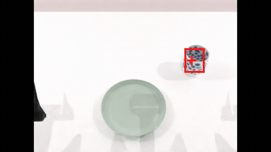
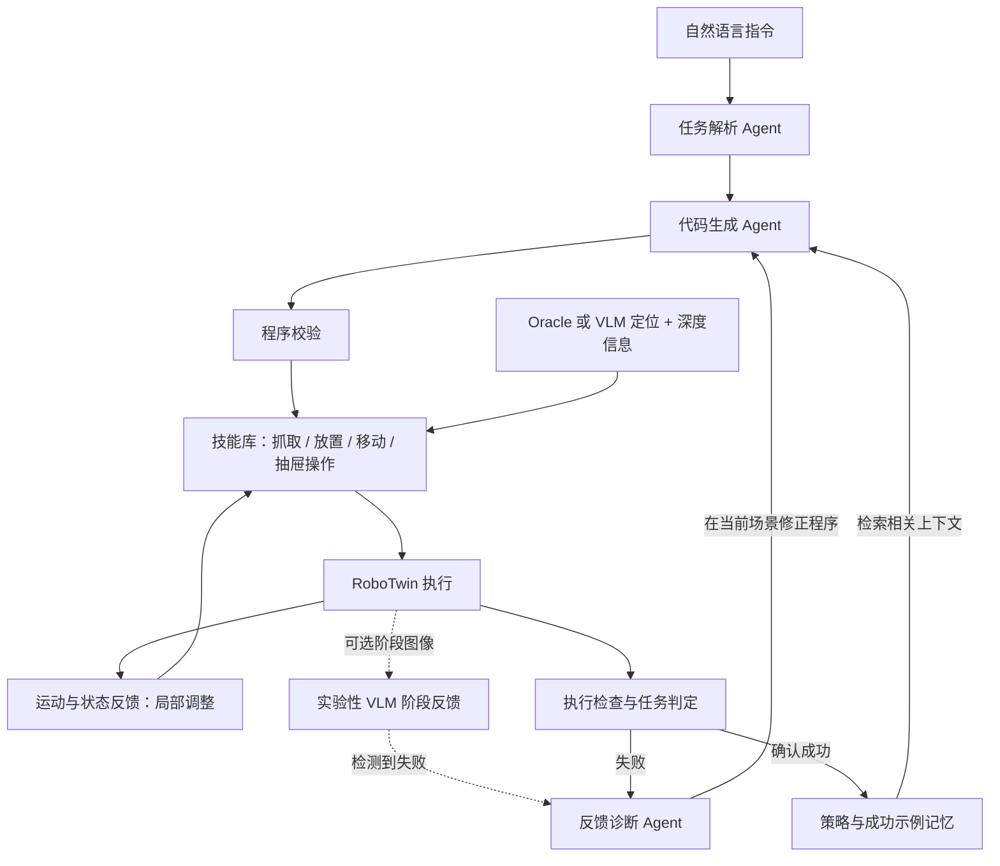

# GAPA：记忆增强的机器人程序生成

**中文** · [English](README.md) · [系统架构](docs/architecture.md) · [实验记录](docs/experiments.md)

**将自然语言指令转化为机器人技能程序，并根据执行反馈在当前场景中纠错。**

GAPA 是基于 **RoboTwin 2.0** 的实验性程序生成系统。任务解析、代码生成与反馈诊断三个 Agent 分工协作，组合封装的抓取、放置、移动及抽屉操作技能完成任务；VLM 定位、执行检查与任务策略记忆为这一过程提供支持。

## 运行演示

| 杯子放置与失败恢复 | 按指定顺序堆叠积木 |
| :---: | :---: |
|  |  |
| 诊断失败原因，在保留当前场景的情况下继续尝试。 | 将自然语言要求转化为有序的机器人技能调用。 |

以上是历史开发演示，不是基准测试，也不用于证明本次新增实验功能的效果。演示来源与验证状态见[实验记录](docs/experiments.md)。

## 核心能力

- **多智能体分工：**将自然语言解析为结构化任务，生成技能程序，并根据执行证据提出修正建议。
- **感知与技能结合：**使用 Oracle 状态或 VLM 定位与深度信息获取支持的物体及功能点位置，再通过受限技能接口执行。
- **两层执行纠错：**在支持的技能内部调整运动参数；局部调整无法解决时，诊断失败并重新生成程序，在当前场景继续执行。
- **按任务检索记忆：**检索相关策略模板辅助生成；实验性扩展可保存成功程序，并检索兼容的技能参数作为参考。

**实验功能：**可选择开启 `after_lift`、`after_place` 阶段反馈，结合多视角视觉报告与仿真抬升状态检查。检查发生在技能阶段之间，不是每个控制步持续监控；对整体恢复效果和执行延迟的影响仍需对照实验验证。

## 本地验证

在 RTX 4060 Laptop 上，固定种子的杯子放置任务在关闭和开启新增检查时均通过环境成功判定；开启后产生了抬起、放置两个阶段的视觉报告。36 项定向回归测试通过。这些结果验证功能接通，尚不能说明成功率提升。[结果、限制与复现命令 →](docs/experiments.md)

## 工作流程


```mermaid
flowchart TD
    I["自然语言指令"] --> P["任务解析 Agent"]
    P --> C["代码生成 Agent"]
    C --> G["程序校验"]
    G --> S["技能库：抓取 / 放置 / 移动 / 抽屉操作"]
    S --> E["RoboTwin 执行"]
    V["Oracle 或 VLM 定位 + 深度信息"] --> S
    E --> L["运动与状态反馈：局部调整"]
    L --> S
    E --> K["执行检查与任务判定"]
    E -. "可选阶段图像" .-> X["实验性 VLM 阶段反馈"]
    X -. "检测到失败" .-> F["反馈诊断 Agent"]
    K -- "失败" --> F
    F -- "在当前场景修正程序" --> C
    K -- "确认成功" --> M["策略与成功示例记忆"]
    M -- "检索相关上下文" --> C
```

VLM 模式也**不是纯视觉机器人控制**：底层运动原语仍使用仿真中的 actor 与接触信息，任务最终是否成功由确定性的环境规则判断。[实现细节与能力边界 →](docs/architecture.md)

## 本地运行

先按照保留的 [RoboTwin 原始说明](README.RoboTwin.md) 安装仿真环境和资产，然后在仓库根目录运行：

```bash
pip install -r gapa/requirements.txt
cp gapa/gapa_api.env.example gapa/gapa_api.env
```

在 `gapa/gapa_api.env` 中填写 LLM 的服务地址、模型和密钥。使用视觉定位或实验性视觉反馈时，还需配置 VLM。随后启动本地界面：

```bash
python -m uvicorn gapa.web.app:app --host 127.0.0.1 --port 7860
```

打开 **http://127.0.0.1:7860**，选择场景物体和种子、生成场景，再输入任务。例如，在选好对应物体后：

- “把杯子放到盘子上。”
- “把红、绿、蓝积木从左到右排列。”
- “将积木按红色在底部、绿色在中间、蓝色在顶部的顺序堆叠。”
- “把扑克牌放入柜子。”

界面可以查看生成程序、执行轨迹、场景图像、诊断反馈和视频，运行产物保存在 `runs_gapa/`。

也可以启动一次输出目录与记忆隔离的杯子放置试验：

```bash
python -m gapa.evaluate --case cup --seed 2 --perception oracle \
  --output runs_gapa/showcase/baseline
```

添加 `--stage-feedback` 可开启实验性视觉检查，每次运行需使用**新的输出目录**。单次试验最多进行三轮程序生成；设置和结果解释见[实验记录](docs/experiments.md)。

## 支持范围与验证状态

目前覆盖支持物体的放置、特定物体入柜、两个或三个积木的排列与堆叠、小距离相对移动，以及支持任务的顺序组合。不支持的指令会在程序生成前被拦截。

当前范围为固定物体集合上的仿真操作。记忆与 VLM 阶段反馈的对照评估仍待完成；[实验记录](docs/experiments.md)提供开发案例、对照设置与验证状态。

## 基于 RoboTwin

本项目在 [RoboTwin](https://github.com/RoboTwin-Platform/RoboTwin) 上新增 GAPA 程序生成与执行层。仿真器、机器人资产及底层控制基础设施来自上游项目；原始文档和引用信息保留在 [README.RoboTwin.md](README.RoboTwin.md)，许可证见 [LICENSE](LICENSE)。
