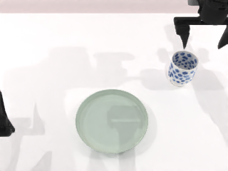
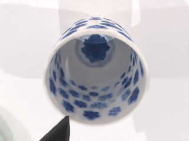

# Experiments and evidence / 实验与证据

[English overview](../README.md) · [中文首页](../README.zh-CN.md) · [Architecture](architecture.md)

This page separates historical development examples from controlled evaluation. No benchmark improvement from stage feedback or successful-example memory is claimed yet.

本页区分历史开发案例与对照实验。目前尚未声明阶段反馈或成功示例记忆带来基准性能提升。

## Verified smoke runs · 2026-09-27 / 已完成的功能试跑

Both runs used an RTX 4060 Laptop (8 GB), `deepseek-v4-pro`, `qwen-vl-max`,
Oracle localization, clean table, cup + plate, scene seed `2`, and fresh isolated
memory. The final native predicate required cup XYZ error below 0.05 / 0.05 /
0.03 m and both grippers open. [Machine-readable results](results/2026-09-27-smoke.json).

两次均使用相同任务、种子和空记忆，结果如下。这里是功能试跑，样本不足以报告成功率提升。

| Variant / 设置 | Native result / 环境判定 | Attempts / 尝试 | Stage observations / 阶段检查 | Total wall time / 总耗时 |
| --- | --- | --- | --- | --- |
| Original runtime + evaluation CLI / 原执行器 | Success / 成功 | 1 | Off / 关闭 | 206.01 s |
| Updated runtime + stage feedback / 新执行器开启阶段检查 | Success / 成功 | 1 | `after_lift`: ok, 0.95; `after_place`: ok, 0.95; 6 camera requests | 223.71 s |

The updated run also archived one verified atomic program and its explicit
`pick`/`place` tuning parameters. Retrieval into a later generation prompt is
covered by targeted integration tests; no learned-memory performance gain is
claimed. The two fresh model-generated programs and prompts were not held
identical, so the timing difference is not an isolated estimate of monitor overhead.

新增记忆在本次成功后保存了一条程序及抓取、放置参数。后续生成提示是否能检索到这些参数已由定向集成测试验证，但尚未评估记忆对成功率的影响。两次模型生成程序与提示并非完全相同，耗时差也不能单独归因于视觉检查。

Before these completed runs, two initialization probes failed because moving the
workspace left stale cuRobo editable-install and robot YAML paths. Both failures
are retained in the local experiment archive; no manipulation was attempted in
them. Updating the existing paths, with backups, restored the simulator.

## Historical development records / 历史开发记录

The inspected development archive contains **19 runs: 15 recorded successes and 4 recorded failures**. These runs were collected during development with changing tasks or settings, rather than sampled under a fixed evaluation protocol. Their ratio is not reported as a benchmark success rate, and the archive predates the new experimental extensions.

已检查的开发记录包含 **19 次运行，其中 15 次记录为成功、4 次记录为失败**。这些记录来自开发过程，任务或配置并不统一，不能将其比例作为基准成功率；它们也早于本次新增实验功能。

The historical cup run `20260615_131247_d2730f8c` records a
`relay_place_failed` executor error, but its video does not establish an actual
failed manipulation. It has been removed as a recovery demonstration. The row
arrangement record also starts with a perception error, so it is not presented
as a visible physical failure either. Log errors alone are insufficient evidence
of a failed physical action.

旧杯子案例有执行器报错，但视频不足以证明操作实际失败，因此撤下其“失败恢复”展示。
积木排列案例的首次错误来自感知，也不作为明显物理失败的替代例子。

### Homepage demonstrations / 首页演示

| Asset / 资产 | Purpose / 用途 | Evidence status / 证据状态 |
| --- | --- | --- |
| [`drop-recovery.gif`](../assets/demos/drop-recovery.gif) | Physical drop, diagnosis and Agent retry / 实际掉落、诊断与 Agent 重试 | Controlled fault, 2026-09-28 / 受控扰动 |
| [`stack.gif`](../assets/demos/stack.gif) | Show ordered skill execution / 展示有序技能执行 | Historical development demonstration / 历史开发演示 |

Source run IDs, perception modes, playback speed, and success details are recorded in the [demo provenance](../assets/demos/README.md). Both previews preserve source chronology. A clip is an illustration, not an additional evaluation trial.

### New recovery demonstration / 新恢复案例（2026-09-28）

A one-shot physical gripper release after a successful lift caused an observed
**8.14 cm drop**. Multi-view VLM reports disagreed; the simulator-height stage
check interrupted execution **before `place` was called**. FeedbackAgent identified
loss of grasp and proposed reobserving the current pose and adjusting the grasp.
CodegenAgent generated a new program (`pre_grasp_dis`: 0.09 → 0.06 m;
`grasp_dis`: 0 → 0.02 m). In the same unchanged environment, its next attempt
picked up the cup and placed it on the plate; the native final check passed.

本次扰动由脚本在抬起后主动松开夹爪施加；杯子真实掉落后，阶段检查中断，诊断 Agent
给出重新观测与调整抓取的建议，代码生成 Agent 生成重试程序。第二次尝试在同一场景完成任务。
与 9 月 27 日的手写恢复探针不同，本次两轮程序和诊断均经过实际模型调用。
这只能证明本次受控扰动下流程跑通，不能证明自然失败恢复率或参数调整的因果收益。

[Portable result with both programs and diagnosis / 两轮程序与诊断结果](results/2026-09-28-agent-drop.json).

```bash
python script/demo_gapa_drop_recovery.py --repo "$PWD" \
  --output runs_gapa/agent_drop_demo
```

The output directory must be new. Keep `manifest.json`, `agent_rounds.json`,
`attempt*/program.py`, stage reports and `video_segments/attempt_*.mp4` together.
Localization is Oracle; stage visual reports use the real configured VLM.

## Controlled drop probe / 受控掉落验证

The first monitor integration (`493d582`) missed a real 8.1 cm drop after a
physical gripper release: the head camera reported failure at 0.95 confidence,
while the active wrist camera reported success at 0.95 and took precedence.
The healthy lift run also produced this visual disagreement, so simply preferring
the head view would have introduced a false alarm.

| Head view / 头部视角 | Wrist view / 腕部视角 |
| --- | --- |
|  |  |

The hybrid revision (`4ff76f0`) retains that disagreement as `uncertain` and
separately checks simulator height. Repeating the same physical release at seed 2
interrupted at `after_lift`, before any `place` call. The cup had risen -0.0010 m
relative to the start of pick, below the 0.03 m lift requirement. A hand-written
recovery program then ran in the same environment: the next lift rose 0.0812 m,
and the final cup-on-plate predicate passed.

这是物理松爪注入故障后的前后验证：修复前漏检，修复后在放置前中断，并由同场景固定程序恢复成功。恢复程序是手写的，**不是 Agent 自动生成恢复的评测成绩**；该单例也不能证明一般失败检测率。判据来源与视觉报告分开记录。

[Before record](results/2026-09-27-drop-before.json) · [After record](results/2026-09-27-drop-after.json)

```bash
python script/probe_gapa_drop.py --repo . \
  --output runs_gapa/showcase/controlled-drop --recover
```

## Run one isolated trial / 运行一次隔离试验

From an installed RoboTwin environment, with LLM credentials configured:

在已安装的 RoboTwin 环境中配置好 LLM 后运行：

```bash
python -m gapa.evaluate --case cup --seed 2 --perception oracle \
  --output runs_gapa/showcase/baseline
```

With experimental stage feedback enabled and VLM credentials configured:

配置 VLM 后，可运行开启阶段反馈的对照：

```bash
python -m gapa.evaluate --case cup --seed 2 --perception oracle \
  --stage-feedback --output runs_gapa/showcase/stage-feedback
```

Every output path must be new. Each run uses isolated memory and allows up to three generation rounds, with a manifest, logs, and video artifacts. The two commands above illustrate paired settings; they are not a published benchmark result.

每次必须使用新的输出目录。每次运行的记忆相互隔离，最多允许三轮生成，并保存清单、日志和视频。以上两条命令演示配对设置，不代表已经获得对照结果。

## Controlled comparison / 对照实验

**Status: results pending.** The following is the evaluation structure, not completed evidence.

**状态：结果待补充。**以下是对照结构，不代表已完成实验。

| Comparison / 对照 | Keep fixed / 固定条件 | Change / 变化因素 |
| --- | --- | --- |
| Program recovery / 程序恢复 | Tasks, seeds, perception, model, skills / 任务、种子、感知、模型、技能库 | One attempt vs. up to three program-generation rounds / 单次尝试与最多三轮生成 |
| Stage feedback / 阶段反馈 | Tasks, seeds, models, retry budget, initial memory / 任务、种子、模型、尝试预算与初始记忆 | Feedback off vs. on / 关闭与开启阶段反馈 |
| Successful-example memory / 成功示例记忆 | Held-out scenes, models, perception, skills, retry budget / 留出场景、模型、感知、技能库与尝试预算 | Strategy templates only vs. templates plus successful examples / 仅策略模板与加入成功示例 |

Use separate results for Oracle and VLM perception. For paired runs, recreate the same initial scene for each condition; within a recovery trial, retain the changed scene between attempts. Fix and report model versions and sampling settings: identical scene seeds do not guarantee identical LLM outputs.

Oracle 与 VLM 感知应分别统计。配对实验的不同配置从相同初始场景开始，但单次恢复试验的多次尝试之间保留变化后的场景。模型版本与采样参数需固定并记录；相同场景种子不保证 LLM 输出相同。

For memory evaluation, build a memory snapshot from separate warm-up scenes and freeze it before evaluation. Test outcomes must not leak into later paired trials through a shared writable memory store.

评估记忆时，使用独立预热场景构建记忆快照，并在评测前冻结。避免共享可写记忆让前面的测试结果影响后面的配对试验。

## What to report / 结果字段

Each result row should identify the task family, perception mode, feedback setting, memory snapshot, number of complete trials, and exact seed list. Report counts with denominators before percentages.

每行结果需注明任务族、感知模式、阶段反馈设置、记忆快照、完整试验数与确切种子列表。先给出分子与分母，再给百分比。

| Metric / 指标 | Definition / 定义 |
| --- | --- |
| First-attempt success / 首次成功 | Tasks passing the native success check on the first execution / 第一次执行即通过环境成功判定的任务数 |
| Success within budget / 预算内成功 | Tasks passing within the stated generation/attempt budget / 在声明的生成轮次与执行预算内完成的任务数 |
| Recovery rate / 恢复率 | Initially failed tasks that later succeed, divided by initial failures / 首次失败后恢复成功数除以首次失败数 |
| Attempts / 尝试次数 | Executed programs per trial; also record generation and validation failures / 每次试验实际执行的程序数，另记生成与校验失败 |
| Latency and VLM calls / 延迟与调用量 | End-to-end time and VLM requests per trial / 每次试验端到端耗时及 VLM 调用次数 |
| Failure categories / 失败类型 | Grasp, motion planning, placement, perception, code generation, or service failures / 抓取、规划、放置、感知、代码生成或服务错误 |

A visual feedback verdict must not replace the native environment predicate when calculating task success. Keep failed and interrupted trials visible; state any exclusions explicitly.

统计任务成功时，视觉反馈结论不能替代环境原生成功判定。保留失败与中断记录，并明确说明任何剔除条件。

## Test-suite baseline / 测试基线

Before the current experimental changes, the inspected Ubuntu checkout ran 114 tests with 8 failures and 6 errors. Reported issues include existing drawer-parameter expectations and cached-position behavior. This is an unresolved baseline, not a passing test-suite claim. New targeted test results and any repairs should be listed separately after verification.

在本次实验性改动前，已检查的 Ubuntu 工作区运行了 114 个测试，其中 8 个失败、6 个错误，涉及既有抽屉参数预期与缓存位置行为等问题。这是尚未清零的基线，不能表述为测试全部通过。新增定向测试结果与修复情况应在验证后单独记录。

**Updated validation:** 36 focused tests passed on the Ubuntu RoboTwin environment,
covering visual confidence handling, skill-boundary events, same-scene recovery
wiring, API forwarding, verified memory, and refusing to mark a generated-only
program as successful. Full local discovery ran 163 tests with 9 failures and 6
errors. Adding an explicit test-package marker made previously hidden VLM tests
importable; their two errors and one failure were reproduced on the untouched
`ea36d9e` snapshot. Existing drawer/fixture disagreements remain unresolved.

**更新后验证：**36 项定向测试通过。完整本地测试发现运行 163 项，仍有 9 个失败、6 个错误；新增可加载的三项 VLM 测试问题已在原始提交复现，不能把完整套件称为全绿。

```bash
python -m unittest tests.test_gapa_feedback tests.test_gapa_success_memory \
  tests.test_gapa_program_codegen.StageMonitorTest \
  tests.test_gapa_runner_attempt_env.GapaRunnerAttemptEnvTest.test_attempts_continue_in_same_recovery_env \
  tests.test_gapa_stage_feedback_web tests.test_gapa_orchestrator_verification -v
```

## Reproduction record / 复现记录

Each published comparison should include:

- Code revision, environment versions, GPU, model identifiers, and sampling settings. / 代码版本、环境版本、GPU、模型标识与采样参数。
- Task instructions, object sets, clean/cluttered setting, initial seeds, and retry budget. / 指令、物体集合、桌面设置、初始种子与尝试预算。
- Perception and stage-feedback modes, plus the initial memory snapshot. / 感知与阶段反馈模式，以及初始记忆快照。
- Generated programs, failure reports, native success details, and per-attempt timings. / 生成程序、失败报告、环境成功判定明细与逐次耗时。
- A representative success, a recovered failure, and an unrecovered failure video when available. / 具有代表性的成功、恢复成功及未恢复失败视频。

Keep API credentials and machine-specific connection details out of published artifacts. / 公开产物不包含 API 密钥和机器连接信息。
